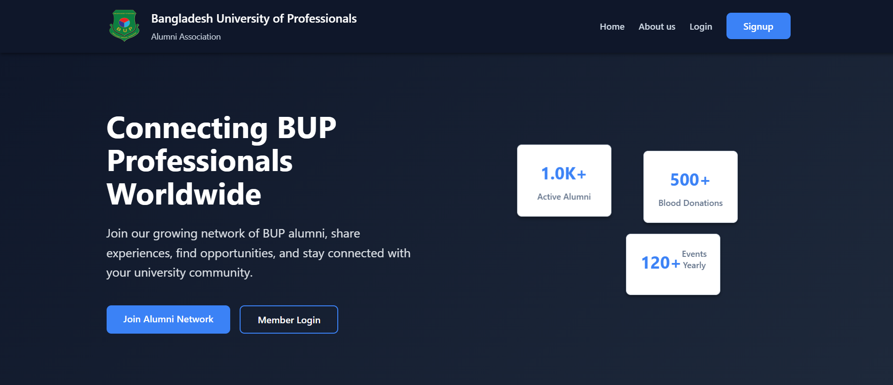

# 🌟 BUP Alumni System


Team Name: BUP Alumni Devs  
Developed by students of **Information and Communication Engineering, BUP**, focusing on connecting alumni, students, and the university through a centralized platform.

## Team Members:
- Hasibul Islam Mitul – 2254901035 
- Samia Maliha – 2254901043  
- Ishrat Jahan – 2254901071  
- Anika Tasnim Mrittika – 2254901115 

---

## How to Use

### 1. Clone the Project
* Install Git Bash if not already installed.  

* Open Git Bash in your local project directory and configure Git:

```bash
git config --global user.name <github_username>
git config --global user.email <github_email>
```

* Clone the repository:
```bash
git clone https://github.com/lamin43-BUP/BUP_Alumni.git
```


### 2. Navigate to the Project Directory
```bash
cd BUP_Alumni
```
Open the project in VS Code:
    ```bash
    code .
    ```

Open the terminal in VS Code: **Ctrl + J**


### 3. Run the Project on VS code


<br>
<br>
<br>


## 🛠️ How to Develop 

### 1\. Commit and Push Changes

After making your changes, commit them to your current branch and push them to the remote repository:

  * Stage all modified files:
    ```bash
    git add .
    ```
  * Commit the changes with a descriptive message:
    ```bash
    git commit -m "Description of changes made"
    ```
  * Push your changes to the remote repository:
    ```bash
    git push origin <your_current_branch_name>
    ```

### 2\. Check CI

  * Go to GitHub **Actions**.
  * Click on the relevant pipeline run for your branch.
  * Ensure all automated tests pass before proceeding.

### 3\. Create a Pull Request

  * Once development is complete and tests pass, create a **Pull Request (PR)** from your branch to the main development branch (`main`).

### 4\. Review and Merge

  * Collaborators will **review** the code and provide feedback on the Pull Request.
  * If approved, **merge** your changes into the main branch.


### 5. Visit the Application in Browser
* Open your browser and visit:
    `http://localhost/BUP_Alumni/index.html`
